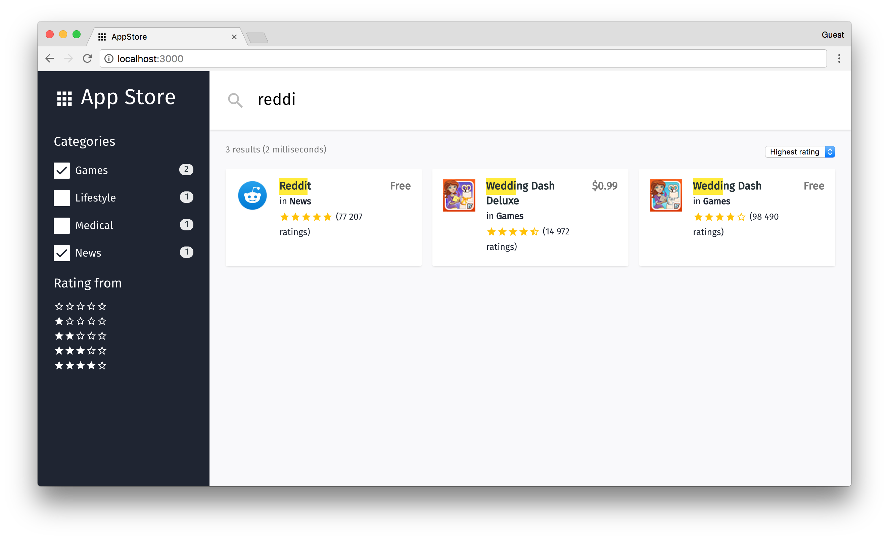

# 📱 Algolia AppStore - Frontend

> Instant-search application to find apps in Algolia indices.

  <a href="https://appstore-francoischalifour.netlify.com">
    
    View demo 🔎
  </a>

## Features

* Search for apps
* Filter by:
  * category
  * rating
* Sort by:
  * lowest rating
  * highest rating
* Load next pages on scroll

## Getting started

* Clone the repo
* [Set the environment variables](#environment)
* Install Node dependencies: `yarn install`
* Run the app: `yarn start`
* Listening on: [`http://0.0.0.0:3000`](http://0.0.0.0:3000)

*You can also use npm.*

## Development setup

### Environment

| Variable                    | Default | Description          |
| --------------------------- | ------- | -------------------- |
| `REACT_APP_ALGOLIA_APP_ID`  | ""      | Your Algolia app ID  |
| `REACT_APP_ALGOLIA_API_KEY` | ""      | Your Algolia API key |

To set these environment variables, duplicate the file [`.env.sample`](.env.sample) and rename it [`.env`](.env). Provide your Algolia credentials in the latter, which will never be committed.

### Commands

* Run: `yarn start`
* Lint: `yarn lint`
* Fix lint: `yarn lint:fix`
* Test: `yarn test`

*You can also use npm.*

## Design decisions

### UI Library

[**React**](https://github.com/facebook/react) was used for this frontend app because this is the UI library I like the most working with. The project was bootstraped with [**Create React App**](https://github.com/facebookincubator/create-react-app) to avoid too much tooling and to enjoy the nice environment it provides. CRA also makes the skeleton of the app available offline with Service Workers without any trouble.

### Algolia features

The initial goal of the app was to list the apps matching the user's query, filter by category and sort by rating ASC/DESC.

I used [algoliasearch](https://github.com/algolia/algoliasearch-client-javascript) to use the Algolia Search REST API along with [algoliasearch-helper](https://github.com/algolia/algoliasearch-helper-js)  to manage search, facets and other Algolia's features. Eventually, I used [react-algoliasearch-helper](https://github.com/algolia/react-algoliasearch-helper) to connect all my components together.

To sort by rating ASC, I decided to create a [replica index](https://www.algolia.com/doc/guides/ranking/sorting/#algolia-replica-indices) from the default `apps` index with rating sort-by strategy set to ascending.

I added a [rating filter](src/components/RatingFilter.js) to show only apps having a rating higher than selected. I decided to enhance the experience by [increasing the hits per page](src/components/Loader.js) when the user reaches the bottom of the page.

### Tooling

I used this project as a playground for new technologies that I wanted to discover. I used [CSS Grids](https://developer.mozilla.org/en-US/docs/Web/CSS/CSS_Grid_Layout), the [Intersection Observer API](https://developer.mozilla.org/en-US/docs/Web/API/Intersection_Observer_API), [glamor](https://github.com/threepointone/glamor), [glamorous](https://github.com/paypal/glamorous) and [dotenv](https://github.com/motdotla/dotenv) for the first time. It is worth mentioning that this app is not meant to be run in old browsers, since I used recent technologies. I chose not to use polyfills as this is not the goal of this project.

The project was boostraped with [**Create React App**](https://github.com/facebookincubator/create-react-app), which provide an implicit set of tooling that I don't have the handle.

I used [**Standard JS**](https://github.com/feross/standard) as code style, because I believe we should not spend time dicussing on rules.

Some basic tests for utility functions have been written with [**Jest**](https://github.com/facebook/jest).

I decided to give [**CSS Grids**](https://developer.mozilla.org/en-US/docs/Web/CSS/CSS_Grid_Layout) a go. It's really powerful but I didn't use all the features for the app.

I've heard a lot about [**glamorous**](https://github.com/paypal/glamorous) but still hadn't use it, I quite like it!

Environment variables are set with [**dotenv**](https://github.com/motdotla/dotenv), which is incredibly handy, especially when open sourcing a project.

Eventually, I deployed [the app](https://appstore-francoischalifour.netlify.com) with [**Netlify**](https://www.netlify.com/).

## Related

* [algolia-appstore-backend](https://github.com/francoischalifour/algolia-appstore-backend)

## License

MIT © [François Chalifour](https://francoischalifour.com)
